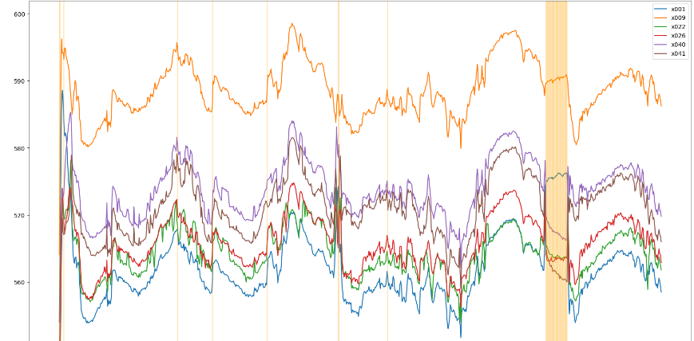

# ТурбоХакатон 2022
https://codenrock.com/contests/turbohackaton#/tasks
 
## Задача 1 - Очистка данных для построения моделей оборудования
#### Постановка:
При создании статистической математической модели оборудования в системе предиктивной аналитики (далее – СПА) требуется провести чистку исходных архивных данных для обучающей модель выборки. 

При валидации отбраковываются:
- Недостоверные данные;
- Нехарактерные выбросы значений, как во временных рядах, так и в корреляциях параметров.

Предполагается, что дополнительный инструмент по обработке исходных данных ускорит работу специалистов по разработке моделей подключаемого к СПА оборудования, что позволит значительно сократить время подключения нового оборудования к системе предиктивной аналитики.

Примеры выбросов данных: 

## Общий подход к решению задачи
Поиск аномалий разделен на три блока:
1. Первичный анализ. Применение простых методов
2. Вторичная обработка. Применение специальных инструментов по поиску аномалий в данных.
3. Глубокая обработка. Применение моделей машинного обучения

#### Первичный анализ 
- Применение "простых" и надежных инструментов по очистке, позволяет исключить явные выбросы, т.е. значения близкие к 0 или к очень большому значению
- Использование таких подходов как: 
   - определение выбросов через среднеквадратическое отклонение (у которых отклонение выше 3-х стандартных отклонений).
   - определение выбросов через квартили. Делим данные на квартали и выявляем выход значений за полуторный квартильный размах.

#### Вторичная обработка
- Применение "средних" инструментов по очистке:
- Применение методов изоляционных деревьев.
- Поиск ГЭПов данных (резких скачков данных за временной промежуток). Например поиск аномалий у которых был резкий скачок значений (более 2х стандартных отклонений) в течении получаса с одного датчика.

#### Глубокая обработка
Применение средств машинного обучения на базе регрессионной модели.

Для каждого признака производится прогноз значения на основе данных с других датчиков.

В случае значительного отклонения фактического значения от прогнозируемого, принимается решение о наличии аномальных данных
 